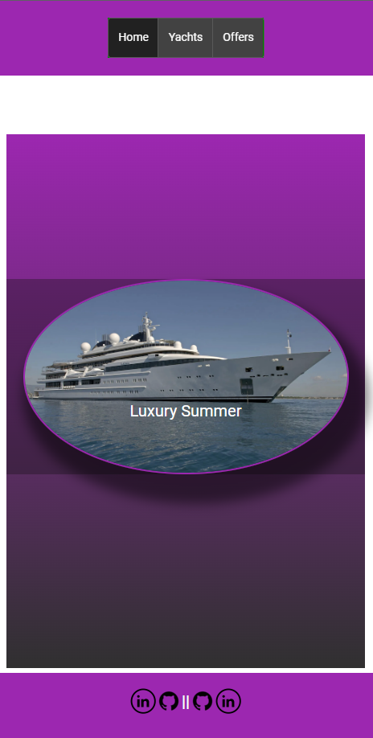
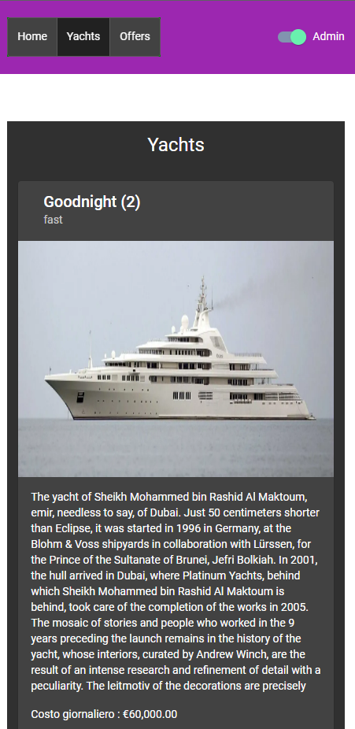
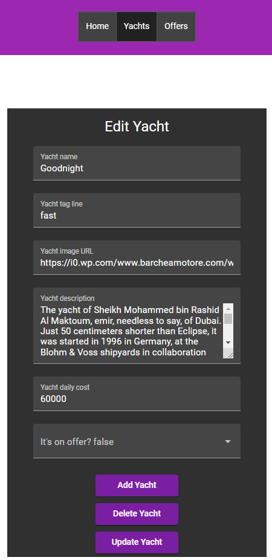

<div id="top" align="center">
  
  
  
  
</div>
&#xa0;

<hr/>

## Ng-Comm-App

<hr/>

  <p>Deploy:
<a href="https://ng-comm-app.netlify.app/">ng-comm-app.netlify.app/</a>
</div>

<hr/>

<p align="center">
  

  

  

  
</p>

<p align="center">
  <a href="#pushpin-about">About</a> &#xa0; | &#xa0; 
  <a href="#pushpin-technologies">Technologies</a> &#xa0; | &#xa0;
  <a href="#pushpin-requirements">Requirements</a> &#xa0; | &#xa0;
  <a href="#memo-license">License</a> &#xa0; | &#xa0;
  <a href="https://github.com/cavaglieridomenico" target="_blank">Author</a>
</p>

<br>

## :pushpin: About

Fictitious service of yacht rental. Team project.<br>
<br>
Single Page Application built with Angular.<br>
Main features implemented:<br>
Services, Reactive Form, Routing, Angular Material.

<br>

The development followed the <a href="https://github.com/cavaglieridomenico/ng-comm-app/projects/1" target="_blank">project tasks</a>.

<br>

## :pushpin: Technologies

The following tools were used in this project:

- [Angular](https://angular.io/)
- [Angular Material](https://material.angular.io/)
- [Javascript](https://www.ecma-international.org/publications-and-standards/standards/ecma-262/)
- [CSS](https://www.w3.org/Style/CSS/)
- [HTML](https://html.spec.whatwg.org/multipage/)
- [Mock API](https://mockapi.io/)
- [Node.js](https://nodejs.org/en/)
- [npm](https://docs.npmjs.com/)
- [Netlify](https://www.netlify.com/)

<br>

## :pushpin: Requirements

<h3>for local installation</h3>

Before starting, you need to have [Node](https://nodejs.org/en/) installed.

```bash
# Access
$ choose the root folder

# Install dependencies
$ npm install

# Navigate to `http://localhost:4200/`.
# The application will automatically reload if you change any of the source files.
$ ng serve --open

# The build artifacts will be stored in the `dist/` directory.
# The build is minified and the filenames include the hashes.
$ ng build
```

<br>

## :memo: License

This project is under license from MIT. For more details, see the [LICENSE](LICENSE.md) file.

&#xa0;

<a href="#top">Back to top</a>
